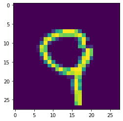

# Informal Response 2 (2/8/2021)

[Back to Home Page](https://jeremy-swack.github.io/applied-machine-learning/)

## Q: What is the purpose of splitting the data into a training set and a test set?

The data is split into a testing set and training set because it allows us to check the external validity of the model. By purposefully withholding a certain percentage of the dataset, we are able to test the model’s ability to label images as either a shoe or not a shoe. If this step was not taken, it would not be possible to tell how the model would do on images it had not already seen before. While internal validity of a model is important, it is also important to check its external validity.

## Q: What are the purposes of the different activation functions in the neural network and why are there 10 neurons in the final layer?

The first activation function, “relu,” is used to make sure that no negative results are used in training the neural network. If the value is not greater than zero, the function returns zero, essentially eliminating any negative values. Using this function makes sure the positive outputs from the function are not cancelled out by negative values.

The function used in the last layer, “softmax,” is used to assign probabilities to the different images. Essentially, the function determines which clothing type the image mostly likely represents. This is also the reason this final layer has ten different neurons. Each neuron represents one of the ten types of clothes in the data set, and the softmax function assigns a probability to each of the ten neurons. Then, the softmax function sets the greatest probability of the ten to one and the rest to zero. The image now has a label.

## Q: How do the optimizer and loss functions operate to produce model parameters (estimates) within the model.compile() function?

The optimizer and loss function of a neural network are used to create the lowest possible error and variance in the neural network. For example, a very common optimizer, gradient descent, uses the first derivative of the loss function to calculate the weights of a neural network. Different optimizers and loss functions are more appropriate depending on the data set being used. For example, using gradient descent on an extremely large dataset would not be a good idea because it would likely take an extremely long time to find the minimum of the derivative. In Maroney’s neural network, he uses a categorical loss function because all of the images are being sorted into individual types of clothing.

Q: What is the shape of the images training set (how many and the dimension of each)?

There are 6000 training images and all of the images are 28x28 pixels.

Q: What is the length of the labels training set?

There are also 6000 labels; there is one label for each image.

Q: What is the shape of the images test set?

There are 1000 test images and labels. This means there is approximately a 85/15 train-test split.

Q: What index of the array has the highest probability of being a number?

For my model, I found that index 235 had the highest probability of being a number. Here is what the image looks like:

It is clear this is supposed to be the number nine.
